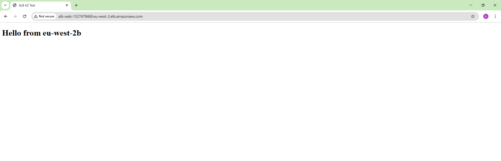
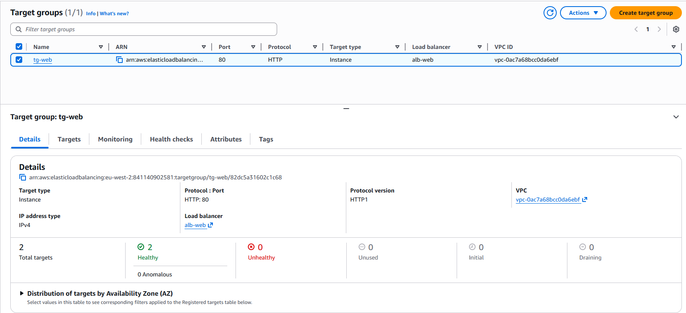

# AWS Application Load Balancer – Multi-AZ EC2 Deployment

This project demonstrates how to deploy multiple EC2 instances across different Availability Zones and place them behind an AWS Application Load Balancer (ALB) to achieve high availability and fault tolerance.

---

## Architecture Overview

- 2 EC2 instances deployed in separate Availability Zones (eu-west-2a and eu-west-2b)
- Application Load Balancer distributing HTTP traffic
- Target Group with health checks enabled
- Apache HTTP Server running on each EC2 instance

Each EC2 instance serves a unique response to identify its Availability Zone.

---

## How It Works

- Incoming HTTP traffic is sent to the ALB
- The ALB forwards requests to healthy EC2 targets
- Responses alternate between Availability Zones:
  - Hello from eu-west-2a
  - Hello from eu-west-2b

This confirms traffic distribution across AZs.

---

## Screenshots

### Response from eu-west-2a

### Response from eu-west-2b

### Target Group Health Checks

---

## Technologies Used

- AWS EC2
- Application Load Balancer (ALB)
- Target Groups & Health Checks
- Amazon Linux
- Apache HTTP Server
- Bash
- SSH

---

## Key Outcomes

- Implemented a highly available web architecture using an Application Load Balancer
- Verified traffic distribution across multiple Availability Zones
- Configured and validated ALB target group health checks
- Deployed and managed EC2 instances running Apache on Amazon Linux
  
---

## Cost Management

All EC2 instances and the Application Load Balancer were terminated after completing the project to avoid unnecessary charges.

---

## Future Improvements

- Recreate the same infrastructure using Terraform
- Add Auto Scaling Group (ASG)
- Add HTTPS using ACM
